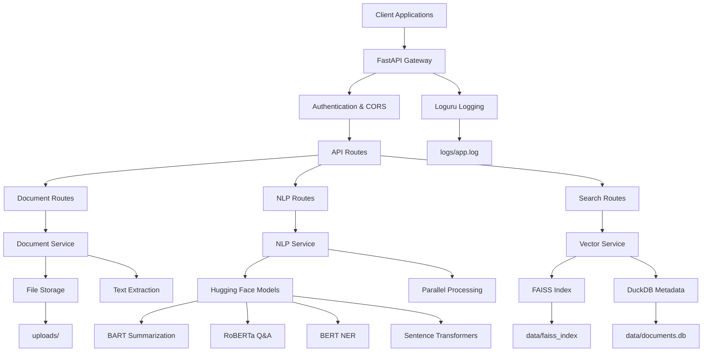
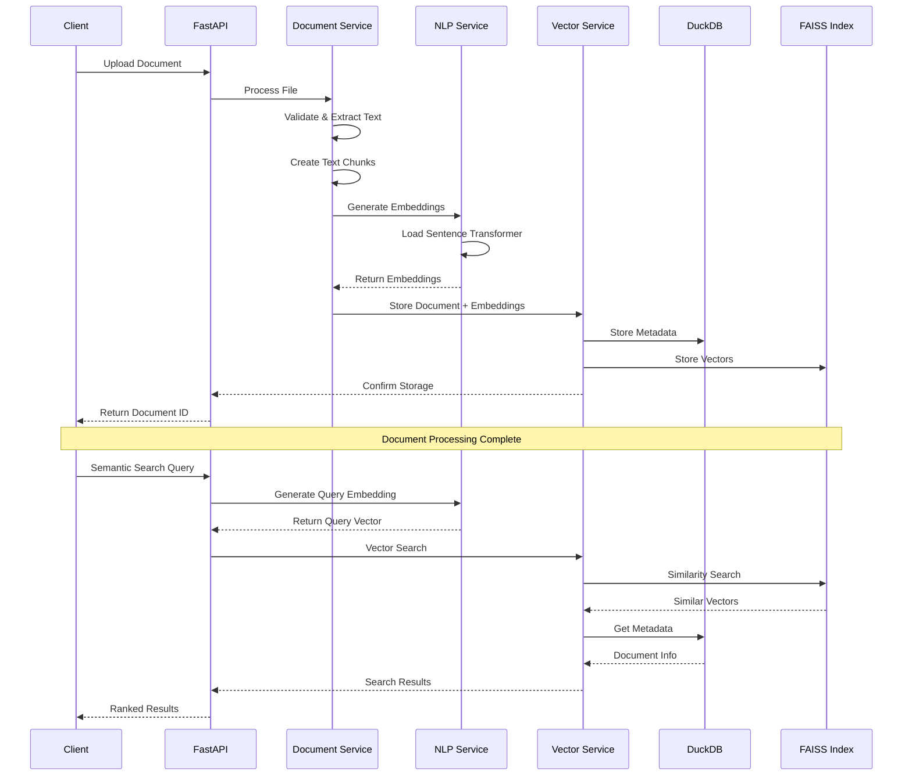
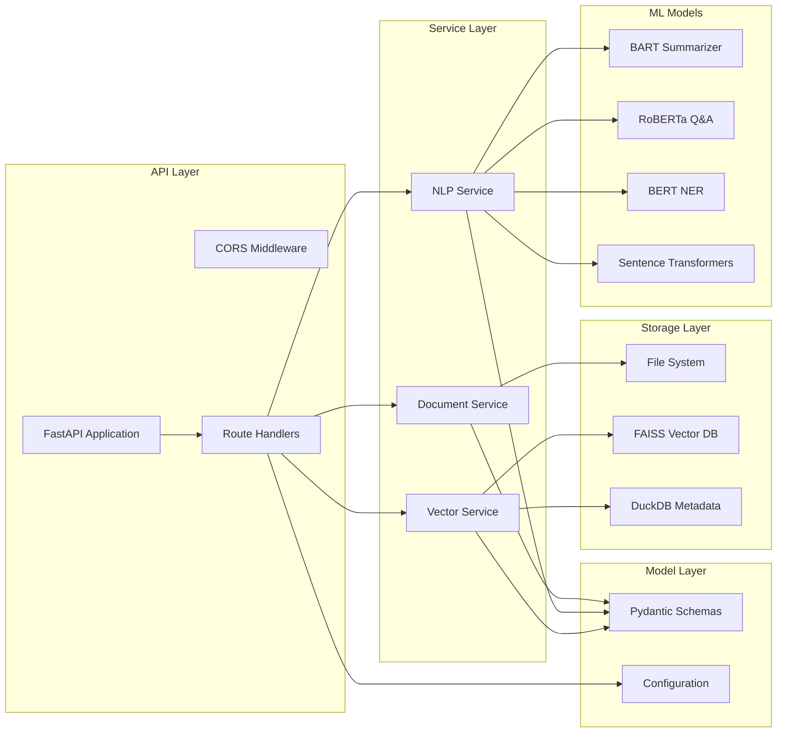

# Intelligent Document & Knowledge Extraction API

A multi-language AI service that automatically extracts insights, summaries, and structured knowledge from unstructured documents using state-of-the-art NLP models.

## 🚀 Features

### Document Processing
- **Multi-format Support**: Handle PDFs, Word documents (.docx, .doc), and text files
- **Async Processing**: Non-blocking document upload and processing
- **Text Extraction**: Robust text extraction with error handling
- **Chunking Strategy**: Intelligent text chunking for optimal processing

### NLP Capabilities
- **Text Summarization**: Generate concise summaries using BART models
- **Question Answering**: Answer questions based on document context using RoBERTa
- **Named Entity Recognition**: Extract entities (persons, organizations, locations) using BERT
- **Language Detection**: Automatic language detection for multi-language support

### Semantic Search
- **Vector Database**: Combine DuckDB + FAISS for efficient vector storage and retrieval
- **Similarity Search**: Find semantically similar documents and passages
- **Context-Aware Q&A**: Search for relevant context and answer questions
- **Batch Processing**: Process multiple documents in parallel

### Production Features
- **Structured Logging**: Comprehensive logging with Loguru
- **Error Handling**: Robust error handling and recovery
- **Async Architecture**: Built with FastAPI and asyncio for high performance
- **Parallel Processing**: Utilize Joblib for CPU-intensive tasks
- **Docker Support**: Complete containerization with Docker and docker-compose

## 🛠 Tech Stack

- **Python 3.11**: Modern Python with type hints
- **FastAPI**: High-performance async web framework
- **Hugging Face Transformers**: State-of-the-art NLP models
- **FAISS**: Efficient similarity search and clustering
- **DuckDB**: Fast analytical database for metadata
- **Loguru**: Structured logging with rotation
- **Docker**: Containerization and deployment

## 📦 Installation

### Prerequisites
- Python 3.11+
- System dependencies for file processing:
  - **macOS**: `brew install libmagic`
  - **Ubuntu/Debian**: `apt-get install libmagic1 libmagic-dev`
  - **CentOS/RHEL**: `yum install file-devel`
- Docker (optional)

### Local Development

1. **Clone the repository**
```bash
git clone <repository-url>
cd Intelligent-Document-Knowledge-Extraction-API
```

2. **Create virtual environment**
```bash
python3.11 -m venv venv
source venv/bin/activate  # On Windows: venv\Scripts\activate
```

3. **Install system dependencies** (if not already installed)
```bash
# macOS
brew install libmagic

# Ubuntu/Debian
sudo apt-get update && sudo apt-get install libmagic1 libmagic-dev

# CentOS/RHEL
sudo yum install file-devel
```

4. **Install Python dependencies**
```bash
pip install --upgrade pip
pip install -r requirements.txt
```

5. **Set up environment**
```bash
cp .env.example .env
# Edit .env file with your configuration if needed
```

6. **Run the application**
```bash
# Using the startup script (recommended)
python start.py

# Or directly with uvicorn
uvicorn app.main:app --reload --host 0.0.0.0 --port 8000
```

### Docker Deployment

1. **Build and run with docker-compose**
```bash
docker-compose up --build
```

2. **Or build manually**
```bash
docker build -t document-extraction-api .
docker run -p 8000:8000 -v $(pwd)/uploads:/app/uploads -v $(pwd)/data:/app/data document-extraction-api
```

## 🔧 API Usage

### Document Upload
```bash
curl -X POST "http://localhost:8000/api/v1/documents/upload" \
  -H "Content-Type: multipart/form-data" \
  -F "file=@document.pdf"
```

### Text Summarization
```bash
curl -X POST "http://localhost:8000/api/v1/nlp/summarize" \
  -H "Content-Type: application/json" \
  -d '{"document_id": "your-document-id", "max_length": 150}'
```

### Question Answering
```bash
curl -X POST "http://localhost:8000/api/v1/nlp/qa" \
  -H "Content-Type: application/json" \
  -d '{"question": "What is the main topic?", "document_id": "your-document-id"}'
```

### Semantic Search
```bash
curl -X POST "http://localhost:8000/api/v1/search/" \
  -H "Content-Type: application/json" \
  -d '{"query": "artificial intelligence", "limit": 10}'
```

### Named Entity Recognition
```bash
curl -X POST "http://localhost:8000/api/v1/nlp/ner" \
  -H "Content-Type: application/json" \
  -d '{"document_id": "your-document-id"}'
```

## 📚 API Documentation

Once the server is running, visit:
- **Interactive API Docs**: http://localhost:8000/docs
- **ReDoc Documentation**: http://localhost:8000/redoc

## 🏗 System Design

### High-Level Architecture



### Data Flow Architecture



### Component Architecture



### File Structure

```
├── app/
│   ├── api/
│   │   └── routes/          # API endpoints
│   │       ├── document.py  # Document upload/management
│   │       ├── nlp.py       # NLP processing
│   │       └── search.py    # Semantic search
│   ├── core/
│   │   ├── config.py        # Configuration management
│   │   └── logging.py       # Logging setup
│   ├── models/
│   │   └── schemas.py       # Pydantic models
│   ├── services/
│   │   ├── document_service.py  # Document processing
│   │   ├── nlp_service.py       # NLP operations
│   │   └── vector_service.py    # Vector database
│   └── main.py              # FastAPI application
├── data/                    # Database files
│   ├── documents.db         # DuckDB metadata
│   ├── faiss_index.index    # FAISS vector index
│   └── faiss_index.metadata # FAISS metadata
├── uploads/                 # Uploaded documents
├── logs/                    # Application logs
├── requirements.txt         # Dependencies
├── Dockerfile              # Container configuration
├── docker-compose.yml      # Multi-container setup
└── start.py               # Startup script
```

### Technology Stack Details

| Component | Technology | Purpose |
|-----------|------------|---------|
| **API Framework** | FastAPI + Uvicorn | High-performance async web framework |
| **Document Processing** | PyPDF2, python-docx | Extract text from various formats |
| **NLP Models** | Hugging Face Transformers | State-of-the-art language models |
| **Vector Search** | FAISS | Efficient similarity search |
| **Metadata Storage** | DuckDB | Fast analytical queries |
| **Embeddings** | Sentence Transformers | Semantic text representations |
| **Parallel Processing** | Joblib | CPU-intensive task optimization |
| **Logging** | Loguru | Structured logging with rotation |
| **Validation** | Pydantic | Data validation and serialization |
| **Containerization** | Docker | Deployment and scaling |

### Scalability Considerations

- **Horizontal Scaling**: Multiple API instances behind load balancer
- **Model Caching**: Lazy loading and memory-efficient model management
- **Vector Database**: FAISS supports distributed indexing
- **Async Processing**: Non-blocking I/O for high concurrency
- **Background Tasks**: Document processing in separate threads
- **Resource Management**: Configurable worker pools and memory limits

## ⚙️ Configuration

Key configuration options in `.env`:

```env
# API Settings
HOST=0.0.0.0
PORT=8000
DEBUG=true

# Models (Compatible versions tested)
SUMMARIZATION_MODEL=facebook/bart-large-cnn
QA_MODEL=deepset/roberta-base-squad2
NER_MODEL=dbmdz/bert-large-cased-finetuned-conll03-english
EMBEDDING_MODEL=sentence-transformers/all-MiniLM-L6-v2

# Processing
MAX_WORKERS=4
CHUNK_SIZE=512
CHUNK_OVERLAP=50
MAX_FILE_SIZE=52428800  # 50MB

# File Upload
UPLOAD_DIR=uploads
ALLOWED_EXTENSIONS=[".pdf", ".docx", ".txt", ".doc"]

# Database Paths
VECTOR_DB_PATH=data/vector_db
FAISS_INDEX_PATH=data/faiss_index
DUCKDB_PATH=data/documents.db

# Logging
LOG_LEVEL=INFO
LOG_FILE=logs/app.log
LOG_ROTATION=10 MB
LOG_RETENTION=30 days
```

## 🚦 Health Monitoring

- **Health Check**: `GET /health`
- **Statistics**: `GET /api/v1/search/stats`
- **Logs**: Check `logs/app.log` for detailed application logs

## 🔒 Security Considerations

- File type validation using python-magic
- File size limits (configurable)
- Input sanitization for all endpoints
- CORS configuration for web applications

## 🧪 Testing

```bash
# Run tests (when test files are created)
pytest

# Run with coverage
pytest --cov=app tests/

# Quick API test
curl http://localhost:8000/health
```

## 🚀 Quick Start Guide

1. **Start the API**:
   ```bash
   python start.py
   ```

2. **Check health**:
   ```bash
   curl http://localhost:8000/health
   ```

3. **Upload a document**:
   ```bash
   curl -X POST "http://localhost:8000/api/v1/documents/upload" \
     -F "file=@your-document.pdf"
   ```

4. **Visit the interactive docs**: http://localhost:8000/docs

## 🔧 Troubleshooting

### Common Issues

**Import Error: `cannot import name 'cached_download'`**
- Solution: Update sentence-transformers to version 2.7.0
- Run: `pip install sentence-transformers==2.7.0`

**File Magic Error**
- Install system dependencies:
  - macOS: `brew install libmagic`
  - Ubuntu: `sudo apt-get install libmagic1 libmagic-dev`

**Model Download Issues**
- Models are downloaded automatically on first use
- Ensure internet connection for initial setup
- Models are cached locally after first download

**Memory Issues**
- Reduce `MAX_WORKERS` in `.env` for lower memory usage
- Use CPU-only mode by setting `device="cpu"` in services

## 📈 Performance

- **Async Processing**: Non-blocking I/O operations
- **Parallel Inference**: Joblib for CPU-intensive NLP tasks
- **Vector Search**: FAISS for sub-linear similarity search
- **Caching**: Lazy model loading and result caching
- **Streaming**: Support for large document processing

## 🤝 Contributing

1. Fork the repository
2. Create a feature branch
3. Make your changes
4. Add tests
5. Submit a pull request

## 📄 License

This project is licensed under the MIT License - see the LICENSE file for details.
A multi-language AI service that automatically extracts insights, summaries, and structured knowledge from unstructured documents.
